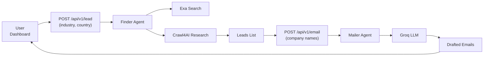

# Wakaima

AI-powered lead generation and outreach automation platform. Wakaima automates the process of finding potential leads (companies), researching them, and drafting personalized outreach emails — all powered by LLM agents.

## Architecture

Wakaima is a **Turborepo monorepo** with two applications:

| App | Description | Stack |
|-----|-------------|-------|
| [`apps/web`](./apps/web) | Next.js frontend dashboard | Next.js 16, React 19, Tailwind CSS v4, shadcn/ui, Prisma, Better Auth |
| [`apps/agents-service`](./apps/agents-service) | FastAPI AI agent service | Python 3.12+, FastAPI, LangGraph, Groq, Exa, Crawl4AI |

### How it works



1. **Lead Discovery** — The user specifies an industry and country. The **Finder Agent** (LangGraph) searches the web via Exa, crawls company websites with Crawl4AI, and returns a list of qualified leads.
2. **Email Drafting** — The user selects companies from the discovered leads. The **Mailer Agent** uses Groq's LLM to draft personalized outreach emails for each company.
3. **Dashboard** — The Next.js frontend provides a UI for managing leads, viewing drafted emails, and tracking outreach.

## Getting Started

### Prerequisites

- **Node.js** ≥ 20 and **Bun** ≥ 1.3 ([install Bun](https://bun.sh))
- **Python** ≥ 3.12 and **uv** ([install uv](https://docs.astral.sh/uv/))
- API keys for external services (see Environment Variables below)

### Installation

```bash
# Clone the repository
git clone <repo-url>
cd wakaima

# Install frontend dependencies (Bun workspaces)
bun install

# Install Python dependencies
cd apps/agents-service
uv sync
cd ../..
```

### Environment Variables

Create `.env` files in each app directory.

**`apps/agents-service/.env`**:

```env
GROQ_API_KEY=your_groq_api_key
EXA_API_KEY=your_exa_api_key
CRAWL4AI_API_KEY=your_crawl4ai_api_key   # optional
```

**`apps/web/.env`**:

```env
DATABASE_URL=file:./prisma/dev.db
BETTER_AUTH_SECRET=your_auth_secret
BETTER_AUTH_URL=http://localhost:3000
AGENTS_SERVICE_URL=http://localhost:8000
RESEND_API_KEY=your_resend_api_key       # for sending emails
```

### Running Locally

Start both apps with a single command:

```bash
# From the repo root — runs both apps in parallel via Turbo
bun dev
```

Or run them individually:

```bash
# Frontend (Next.js)
cd apps/web
bun dev

# Agents service (FastAPI)
cd apps/agents-service
fastapi dev
```

The frontend runs at **http://localhost:3000** and the agents service at **http://localhost:8000**.

## Project Structure

```
wakaima/
├── apps/
│   ├── web/                        # Next.js frontend
│   │   ├── app/
│   │   │   ├── (auth)/             # Sign-in / sign-up pages
│   │   │   ├── api/                # API routes (Better Auth, agents proxy)
│   │   │   ├── dashboard/          # Dashboard pages
│   │   │   │   ├── leads/          # Lead discovery & management
│   │   │   │   ├── emails/         # Email drafts & sending
│   │   │   │   ├── form/           # Lead search form
│   │   │   │   └── settings/       # User & app settings
│   │   │   ├── layout.tsx          # Root layout
│   │   │   └── page.tsx            # Landing page
│   │   ├── components/
│   │   │   ├── dashboard/          # Dashboard-specific components
│   │   │   └── ui/                 # shadcn/ui components
│   │   ├── emails/                 # React Email templates
│   │   ├── hooks/                  # Custom React hooks
│   │   ├── lib/
│   │   │   ├── actions/            # Server actions
│   │   │   ├── data/               # Data access layer
│   │   │   ├── services/           # External service clients
│   │   │   ├── auth.ts             # Better Auth configuration
│   │   │   └── prisma.ts           # Prisma client
│   │   ├── prisma/
│   │   │   └── schema.prisma       # Database schema
│   │   ├── store/                  # Zustand state stores
│   │   └── package.json
│   │
│   └── agents-service/             # Python AI agent service
│       ├── app/
│       │   ├── agents/
│       │   │   ├── finder.py       # Lead discovery LangGraph agent
│       │   │   └── mailer.py       # Email drafting LangGraph agent
│       │   ├── core/
│       │   │   ├── data.py         # Data handling utilities
│       │   │   ├── models.py       # LLM model configuration (Groq)
│       │   │   ├── nodes.py        # LangGraph node implementations
│       │   │   ├── prompts.py      # Agent prompt templates
│       │   │   └── schemas.py      # Pydantic schemas
│       │   ├── middleware/
│       │   │   └── auth.py         # Authentication middleware
│       │   ├── routes/
│       │   │   └── v1/
│       │   │       ├── emails.py   # POST /api/v1/email
│       │   │       └── leads.py    # POST /api/v1/lead
│       │   └── main.py             # FastAPI app entrypoint
│       ├── pyproject.toml
│       └── uv.lock
│
├── package.json                    # Root workspace config (Bun + Turbo)
├── turbo.json                      # Turborepo pipeline config
└── bun.lock
```

## Key Technologies

### Frontend (`apps/web`)

| Technology | Purpose |
|-----------|---------|
| [Next.js 16](https://nextjs.org) | React framework (App Router) |
| [React 19](https://react.dev) | UI library |
| [Tailwind CSS v4](https://tailwindcss.com) | Utility-first CSS |
| [shadcn/ui](https://ui.shadcn.com) | Component library |
| [Better Auth](https://better-auth.com) | Authentication (email/password + OAuth) |
| [Prisma](https://prisma.io) | ORM with SQLite (libsql) |
| [Zustand](https://zustand.docs.pmnd.rs) | State management |
| [React Email](https://react.email) | Email template rendering |
| [Resend](https://resend.com) | Email delivery |
| [Recharts](https://recharts.org) | Charts and data visualization |
| [TipTap](https://tiptap.dev) | Rich text editor |
| [TanStack Table](https://tanstack.com/table) | Data tables |

### Agents Service (`apps/agents-service`)

| Technology | Purpose |
|-----------|---------|
| [FastAPI](https://fastapi.tiangolo.com) | Web framework |
| [LangGraph](https://langchain-ai.github.io/langgraph/) | Agent orchestration |
| [LangChain](https://python.langchain.com) | LLM framework |
| [Groq](https://groq.com) | LLM inference (fast open-source models) |
| [Exa](https://exa.ai) | Web search for lead discovery |
| [Crawl4AI](https://crawl4ai.com) | Web scraping and research |
| [FastAPI Cloud](https://fastapicloud.com) | Deployment platform |

## Scripts

From the repo root:

```bash
bun dev      # Start all apps in development mode
bun build    # Build all apps for production
bun lint     # Lint all apps
bun clean    # Clean build artifacts
```

## Deployment

### Frontend

The Next.js app can be deployed to any platform that supports Next.js (Vercel, Netlify, etc.):

```bash
cd apps/web
bun run build
```

### Agents Service

The agents service is configured for **FastAPI Cloud** deployment:

```bash
cd apps/agents-service
fastapi deploy
```

The service uses FastAPI Cloud's zero-downtime deployments with autoscaling. See [Configuring FastAPI](https://fastapicloud.com/docs/builds-and-deployments/configuring-fastapi/) for details on the `[tool.fastapi]` entrypoint configuration.

## License

[Add your license here]
