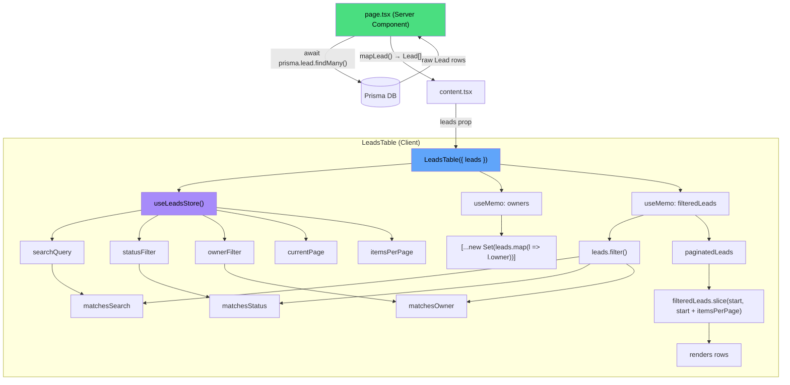

# Leads Table — Data Flow & Architecture

## File Map

```
app/dashboard/page.tsx                    ← Server Component (data fetching)
components/dashboard/content.tsx           ← Client wrapper (props passthrough)
components/dashboard/leads-table.tsx       ← Client Component (table UI, filters, pagination)
store/leads-store.ts                       ← Zustand store (filter + pagination state)
mock-data/leads.ts                         ← Type definition (Lead interface)
```

---

## Data Flow Diagram



---

## Step-by-Step Walkthrough

### 1. Data Fetching — `app/dashboard/page.tsx`

Server Component. Runs **only on the server** — never shipped to the browser.

```ts
import { prisma } from "@/lib/prisma";

export default async function DashboardPage() {
  const rawLeads = await prisma.lead.findMany();
  const leads: Lead[] = rawLeads.map((raw) => ({
    id: String(raw.id),
    leadId: `LD${String(raw.id).padStart(4, "0")}`,
    name: raw.name,
    email: raw.email ?? "",
    avatar: "",
    status: "new",
    owner: "Unassigned",
    ownerInitials: "UN",
    createdAt: "",
    createdTimestamp: 0,
  }));

  return <DashboardContent leads={leads} />;
}
```

| Detail | Value |
|---|---|
| **Runs on** | Server only (async component) |
| **Data source** | Prisma → SQLite/LibSQL via `DATABASE_URL` |
| **Output** | `Lead[]` array, passed as prop |
| **Mapping** | Prisma fields `id`, `name`, `email` → full `Lead` shape with defaults for missing fields |

---

### 2. Props Passthrough — `components/dashboard/content.tsx`

Client Component. Thin wrapper — receives `leads` and forwards to `LeadsTable`.

```tsx
"use client";

export function DashboardContent({ leads }: { leads: Lead[] }) {
  return (
    <main>
      <FilterSection />
      <StatsCards />
      <MonthlyLeadGrowthChart />
      <LeadsByStatusChart />
      <LeadsTable leads={leads} />   // ← passes through
    </main>
  );
}
```

---

### 3. Filter/Pagination State — `store/leads-store.ts`

Zustand store. Holds all mutable filter and pagination state. **Not persisted** — resets on page reload.

```ts
interface LeadsState {
  searchQuery:    string       // "" initially
  statusFilter:   LeadStatus | "all"  // "all" initially
  ownerFilter:    string              // "all" initially
  dateFilter:     DateFilter          // "this_month" initially
  currentPage:    number              // 1 initially
  itemsPerPage:   number              // 10 initially
  setSearchQuery: (query: string) => void
  setStatusFilter: (filter) => void
  setOwnerFilter: (filter) => void
  setDateFilter:   (filter) => void
  setCurrentPage:  (page) => void
  setItemsPerPage: (items) => void
  clearFilters:    () => void         // resets everything except date
}
```

| Setter | Side Effect |
|---|---|
| `setSearchQuery` | Resets `currentPage` to 1 |
| `setStatusFilter` | Resets `currentPage` to 1 |
| `setOwnerFilter` | Resets `currentPage` to 1 |
| `setItemsPerPage` | Resets `currentPage` to 1 |
| `clearFilters` | Resets all filters + page to 1, keeps date as `"this_month"` |

---

### 4. The Table Component — `components/dashboard/leads-table.tsx`

Client Component. This is where everything comes together.

#### Types

| Type | Values | Defined In |
|---|---|---|
| `LeadStatus` | `"new" \| "contacted" \| "qualified" \| "negotiation" \| "inactive" \| "recycled"` | `store/leads-store.ts` |
| `Lead` | `{ id, leadId, name, email, avatar, status, owner, ownerInitials, createdAt, createdTimestamp }` | `app/dashboard/page.tsx` |

#### Configuration Maps

**`statusConfig`** — `Record<LeadStatus, { label: string; className: string }>`

Maps each status to a display label and Tailwind color classes:

| Status | Label | Color |
|---|---|---|
| `new` | New Leads | Blue |
| `contacted` | Contacted | Orange |
| `qualified` | Qualified | Emerald/green |
| `negotiation` | Negotiation | Amber/yellow |
| `inactive` | Inactive | Gray |
| `recycled` | Recycled | Pink |

#### Derived State (all `useMemo`)

| Variable | Computation | Dependencies |
|---|---|---|
| `owners` | `[...new Set(leads.map(l => l.owner))]` — unique owner names | `[leads]` |
| `filteredLeads` | Applies all 3 filters to `leads` | `[leads, searchQuery, statusFilter, ownerFilter]` |
| `totalPages` | `Math.ceil(filteredLeads.length / itemsPerPage)` | derived from `filteredLeads`, `itemsPerPage` |
| `startIndex` | `(currentPage - 1) * itemsPerPage` | derived from `currentPage`, `itemsPerPage` |
| `paginatedLeads` | `filteredLeads.slice(startIndex, startIndex + itemsPerPage)` | derived from `filteredLeads`, `startIndex`, `itemsPerPage` |
| `hasActiveFilters` | `true` if any filter is not default | derived from `searchQuery`, `statusFilter`, `ownerFilter` |

#### Filtering Logic (`filteredLeads`)

```ts
leads.filter(lead => {
  const matchesSearch =
    searchQuery === "" ||
    lead.name.toLowerCase().includes(searchQuery.toLowerCase()) ||
    lead.email.toLowerCase().includes(searchQuery.toLowerCase()) ||
    lead.leadId.toLowerCase().includes(searchQuery.toLowerCase());

  const matchesStatus = statusFilter === "all" || lead.status === statusFilter;
  const matchesOwner = ownerFilter === "all" || lead.owner === ownerFilter;

  return matchesSearch && matchesStatus && matchesOwner;
})
```

- **AND logic** — a lead must match ALL active filters to appear
- **Case-insensitive** — search uses `.toLowerCase()` on both sides
- **"all" = no filter** — when a filter is `"all"`, it short-circuits to `true`

#### Column Spec

| Column | Width | Responsive | Content |
|---|---|---|---|
| Checkbox + Lead ID | `w-[120px]` | Always visible | `<Checkbox />` + `lead.leadId` |
| Lead Name | `min-w-[160px]` | Always visible | `lead.name` |
| Email | `min-w-[180px]` | Hidden below `md` | `lead.email` |
| Status | `w-[110px]` | Always visible | Color-coded `<Badge>` via `statusConfig` |
| Industry | `w-[100px]` | Hidden below `lg` | Static: "Computer retail" |
| Created On | `w-[130px]` | Always visible | `lead.createdAt` + row action menu (⋮) |

#### Row Actions (⋮ menu)

Each row has a kebab menu with:
- **View Details** — (no-op, placeholder)
- **Edit Lead** — (no-op, placeholder)
- **Delete Lead** — (no-op, styled red/destructive)

#### Top Bar UI

| Element | Purpose | State Binding |
|---|---|---|
| Search `<Input>` | Free-text search across name/email/leadId | `searchQuery` → `setSearchQuery` |
| Filter button + dropdown | Status, Owner selects | `statusFilter`/`ownerFilter` → setters |
| "Clear all filters" | Only visible when `hasActiveFilters` | Calls `clearFilters()` |
| Import button | Placeholder | — |

#### Pagination

| Element | Logic |
|---|---|
| Prev button | `setCurrentPage(currentPage - 1)`, disabled on page 1 |
| Page buttons | Shows first 5 pages (or fewer), then `...` + last page if `totalPages > 5` |
| Next button | `setCurrentPage(currentPage + 1)`, disabled on last page |
| Items per page | `<Select>` with options `5, 10, 20, 50` |
| Summary text | `Showing X-Y of Z` |

---

## How to Customize

### Add a new column

1. Add the field to the `Lead` interface in `app/dashboard/page.tsx`
2. Add a `<TableHead>` in the header row (line ~272)
3. Add a `<TableCell>` in the body row (line ~292)
4. Update the `mapLead()` function if the data comes from Prisma

### Add a new filter

1. Add state to `store/leads-store.ts` (`LeadsState` interface + setter)
2. Add the filter UI to the dropdown in `leads-table.tsx`
3. Add the filter condition in the `filteredLeads` `useMemo`

### Change Industry from static to dynamic

1. Add an `industry` field to the Prisma `Lead` model
2. Run `prisma migrate dev`
3. Update `mapLead()` in `page.tsx` to include `industry: raw.industry`
4. Replace `"Computer retail"` with `{lead.industry}` in the table cell
5. Add `industry` to the `Lead` interface

### Reorder columns

Rearrange the `<TableHead>` and `<TableCell>` elements in the same order. Keep headers and cells aligned.
